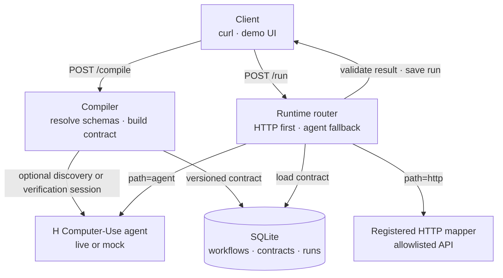
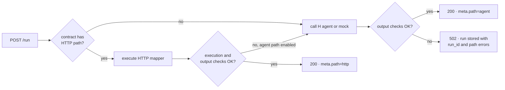
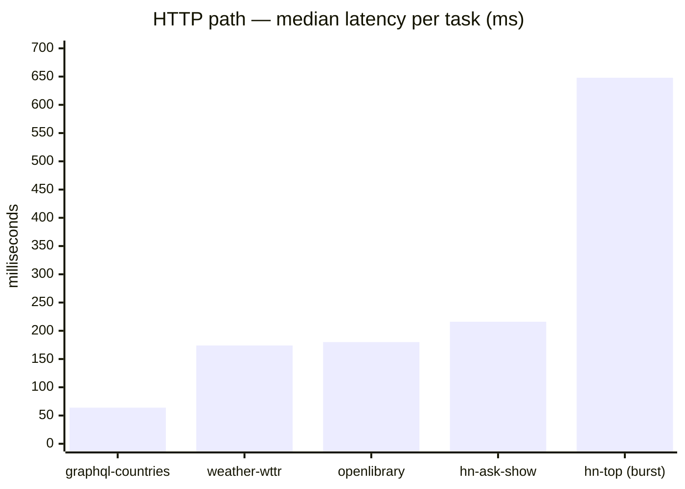
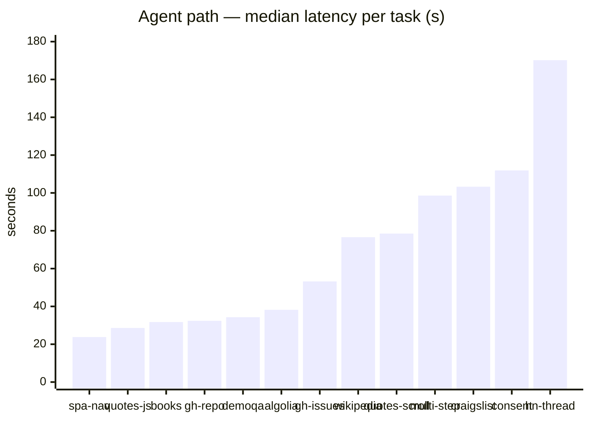
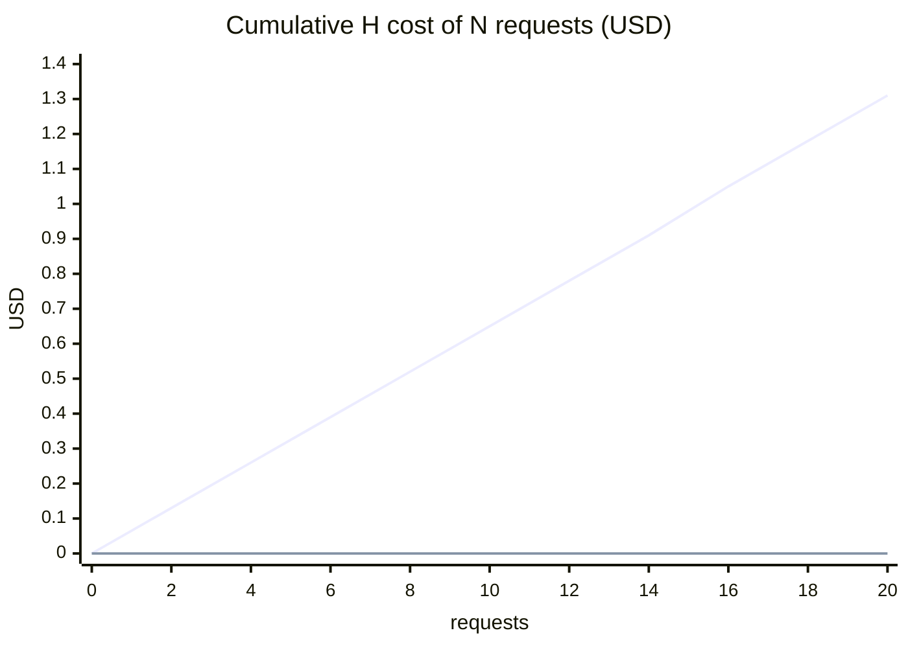

# API H (H Company Agent Project)

API H turns a website workflow into a versioned JSON contract and exposes the
workflow through a REST endpoint. At run time, it uses a registered HTTP mapper
when one matches the workflow's host. If that path fails during execution or
output checks, it can call an H Company Computer-Use agent instead. A successful
response reports the path used, the contract version, and the path latency in
`meta`.

API H has registered HTTP mappers for four hosts: Hacker News, wttr.in, Open
Library, and the Countries GraphQL API. Other hosts use the H agent for every
run. Schema discovery infers JSON schemas; it does not discover HTTP APIs.

## Quick start

You need Python 3.11 or later and [uv](https://docs.astral.sh/uv/). The demo
script also needs `curl`, `jq`, and outbound access to the Hacker News API.

```bash
uv sync
```

Start the server in one terminal:

```bash
uv run uvicorn app.main:app --port 8000
```

Seed the Hacker News workflow and run the demo in another terminal:

```bash
uv run python scripts/seed.py
./scripts/demo_curl.sh
```

The seed script is safe to rerun. Each rerun creates and activates the next
contract version. `demo_curl.sh` compiles once more before its requests, so
running both commands on a fresh database ends at version 2.

Open <http://127.0.0.1:8000/> for the small demo UI. You can also call the seeded
workflow directly:

```bash
curl -s -X POST http://127.0.0.1:8000/v1/workflows/hn-top-stories/run \
  -H 'content-type: application/json' \
  -d '{"input": {"limit": 5}}' \
  | jq '.meta.path, .meta.latency_ms'
```

The default configuration uses the H mock. The request above still needs network
access because its normal path calls the public Hacker News API. If that HTTP
request fails, the hybrid contract tries the mock agent, whose placeholder is
shaped like Hacker News data and may satisfy this workflow's schema.

Run the test suite with:

```bash
uv run pytest
```

The 49 tests run without a network connection or an H API key. They intercept the
external HTTP requests used by the mappers.

## How API H works

Compilation stores a contract in SQLite. A run loads a selected contract, applies
input defaults, executes its configured paths, validates the result, and records
one run row.



### Compilation

When a workflow has an object `output_schema` with properties, compilation uses
the stored schemas. With `engine: "auto"`, live mode performs one H verification
run and mock mode skips it.

When the output schema is missing or has no properties, compilation performs one
discovery run. API H derives inputs from `{{name}}` placeholders in the goal and
infers the output schema from the returned JSON object. `{{limit}}` becomes an
integer with a default of 5 and bounds of 1 through 30. Other placeholders become
strings. For arrays of objects, a field is required only when every sampled item
contains a non-null value for that field.

Discovery uses the configured global H mode. In mock mode, the sample is a
deterministic object shaped like Hacker News data, so schemas discovered in mock
mode are development placeholders. An explicit array schema, primitive schema, or
empty object schema also triggers discovery because the current implementation
looks for object properties.

After resolving the schemas, the compiler matches the workflow hostname against
the registered HTTP integrations. A match creates a `hybrid` contract. Every other
workflow receives an `agent` contract. Activation marks the new version active and
the previous active version deprecated. It also attempts to export the JSON to
`contracts/<slug>-v<version>.json`.

### Runtime routing

| Situation | Runtime behavior |
|---|---|
| `hybrid` contract, normal run | Try HTTP, then the agent if HTTP execution or output checks fail |
| `agent` contract, normal run | Call the agent |
| `force_path: "http"` | Use HTTP only; return 400 if the contract has no HTTP path |
| `force_path: "agent"` | Use the agent only; return 400 if that path is disabled |
| `contract_version` supplied | Run that version, including a draft or deprecated version |
| Every configured path fails | Store the failed run and return 502 with its `run_id` and path errors |

A normal run is one router pass:



The router validates input and output with JSON Schema. Contract health rules can
also require a minimum array length and specific result fields. If an HTTP path
runs longer than 15 seconds, the router logs a warning. If an agent path runs
longer than 10 minutes, its health check fails.

For a successful fallback, `meta.latency_ms` measures the path that returned the
result. It does not include time spent in an earlier failed path. Mock executions
report `meta.path` as `agent` because the mock replaces the H call at that boundary.

## Registered HTTP paths

The compiler selects these integrations by exact workflow hostname. The named
Python mapper performs the request and shapes the response. The `http.steps` array
in a contract records plan metadata; the runtime does not interpret those steps.

| Workflow host | Mapper | HTTP destination | Result |
|---|---|---|---|
| `news.ycombinator.com` | `hn_firebase_v0` | `hacker-news.firebaseio.com` | Ranked stories from the top, ask, or show feed |
| `wttr.in` | `wttr_v0` | `wttr.in` | Temperature, humidity, and weather description for a city |
| `openlibrary.org` | `openlibrary_search_v0` | `openlibrary.org` | Works matching a nonempty query |
| `countries.trevorblades.com` | `graphql_countries_v0` | `countries.trevorblades.com` | Country names for a two-letter continent code |

Adding another HTTP integration requires a mapper in
`app/services/http_executors`, registration in that package, a compiler
specialization, and an allowlist entry for its HTTPS host.

The hostname matcher does not inspect the workflow goal or path. Output
validation and fallback handle mismatches.

## Discover schemas

Create a workflow using a site, a goal, and any input placeholders needed by later
runs:

```bash
curl -s -X POST http://127.0.0.1:8000/v1/workflows \
  -H 'content-type: application/json' \
  -d '{
    "slug": "craigslist-apartments",
    "title": "Craigslist SF Bay apartments",
    "site": "https://sfbay.craigslist.org/search/apa",
    "goal": "Return the top {{limit}} apartment listings with title, price and url"
  }' | jq
```

For a new workflow, compile and activate version 1:

```bash
curl -s -X POST \
  http://127.0.0.1:8000/v1/workflows/craigslist-apartments/compile \
  -H 'content-type: application/json' \
  -d '{"engine": "auto", "activate": true}' | jq
```

Then run the stored contract:

```bash
curl -s -X POST \
  http://127.0.0.1:8000/v1/workflows/craigslist-apartments/run \
  -H 'content-type: application/json' \
  -d '{"input": {"limit": 5}}' | jq
```

Craigslist has no registered mapper in this repository, so this contract uses the
agent for each run. Use live mode for a meaningful schema and result. Mock mode
returns the generic placeholder described above.

API H cannot replace stored schemas. After discovery fills `output_schema`,
`/recompile` reuses that schema for the next contract version. To change it,
create a workflow with explicit object schemas and a new slug.

## Contract format

A contract stores JSON schemas, routing configuration, validation rules, and the
agent prompt. It describes how to fetch data for a new input; each run performs the
configured work.

An abbreviated Hacker News contract contains the router fields below:

```json
{
  "id": "uuid",
  "workflow_id": "uuid",
  "version": 1,
  "status": "active",
  "title": "Hacker News top stories",
  "site": "https://news.ycombinator.com",
  "goal": "Return top N front-page stories with rank, title, url, points",
  "input_schema": {
    "type": "object",
    "properties": {
      "limit": {
        "type": "integer",
        "default": 5,
        "minimum": 1,
        "maximum": 30
      }
    }
  },
  "output_schema": {
    "type": "object",
    "required": ["stories"],
    "properties": {
      "stories": {
        "type": "array",
        "items": {
          "type": "object",
          "required": ["rank", "title", "url", "points"],
          "properties": {
            "rank": {"type": "integer"},
            "title": {"type": "string"},
            "url": {"type": "string"},
            "points": {"type": "integer"},
            "hn_url": {"type": "string"}
          }
        }
      }
    }
  },
  "method": "hybrid",
  "http": {
    "enabled": true,
    "description": "HN Firebase API",
    "steps": [
      {
        "name": "topstories",
        "method": "GET",
        "url_template": "https://hacker-news.firebaseio.com/v0/topstories.json"
      },
      {
        "name": "item",
        "method": "GET",
        "url_template": "https://hacker-news.firebaseio.com/v0/item/{id}.json",
        "foreach": "top_ids"
      }
    ],
    "mapper": "hn_firebase_v0"
  },
  "agent": {
    "enabled": true,
    "agent_id": "h/web-surfer-pro",
    "prompt_template": "Open {{site}}. Return the top {{limit}} stories as JSON matching the schema.",
    "answer_schema_ref": "output_schema"
  },
  "health": {
    "min_array_length": {"path": "stories", "min": 1},
    "required_paths": ["stories.0.rank", "stories.0.title", "stories.0.url", "stories.0.points"],
    "max_latency_ms": 15000,
    "max_latency_ms_agent": 600000
  },
  "compiled_at": "ISO-8601 timestamp",
  "compile_meta": {
    "engine": "mock",
    "session_id": null,
    "notes": "Discovered or selected Firebase path for HN"
  }
}
```

The contracts endpoint returns the full contract. Activation also attempts to
export it as JSON.

## REST API

| Method | Path | Purpose |
|---|---|---|
| `GET` | `/health` | Report service status and `live` or `mock` H mode |
| `POST` | `/v1/workflows` | Create a workflow |
| `GET` | `/v1/workflows` | List workflows |
| `GET` | `/v1/workflows/{id_or_slug}` | Read a workflow and its stored schemas |
| `POST` | `/v1/workflows/{id_or_slug}/compile` | Compile and optionally activate a contract |
| `POST` | `/v1/workflows/{id_or_slug}/recompile` | Run the same compile handler and create the next version |
| `GET` | `/v1/workflows/{id_or_slug}/contracts` | List contract versions |
| `POST` | `/v1/workflows/{id_or_slug}/run` | Run the active or requested contract version |
| `GET` | `/v1/workflows/{id_or_slug}/runs?limit=20` | List recent runs |
| `GET` | `/v1/runs/{run_id}` | Read one run |
| `GET` | `/v1/workflows/{id_or_slug}/openapi.json` | Get an OpenAPI document for one workflow's run endpoint |

FastAPI also provides `/docs`, `/redoc`, and the service-wide `/openapi.json`.
Duplicate slugs return 409. Invalid request models return 422. Bad run input or an
unavailable forced path returns 400. Missing workflows or contracts return 404.
When every run path fails, the response is 502 with `ok`, `errors`, and `run_id`.
For a failed compile, the API returns HTTP 200, `job.status: "failed"`, and
`contract: null`.

## H integration and configuration

API H calls [H Company Computer-Use Agents](https://hub.hcompany.ai/computer-use-agents/introduction)
through the `hai-agents` Python SDK. Running `uv sync` installs the SDK from
`pyproject.toml`. The default agent is `h/web-surfer-pro`; mock mode skips the
SDK.

The application has no Browserbase or Stagehand dependency. The live and mock modes
share the same contract and router code.

Common settings are listed in `.env.example`:

| Variable | Default | Effect |
|---|---|---|
| `HAI_API_KEY` | empty | Supplies the key used in live mode |
| `API_H_MOCK_H` | `true` | Keeps H calls on the deterministic mock when true |
| `HAI_AGENT` | `h/web-surfer-pro` | Selects the H agent |
| `HAI_ENVIRONMENT` | `EU` | Selects the H SDK environment; supported values are `EU` and `US` |
| `API_H_DATABASE_URL` | `sqlite:///./data/api_h.db` | Selects the SQLite database file |

`API_H_HOST`, `API_H_PORT`, and `LOG_LEVEL` in `.env.example` do not affect the
documented start command. Pass their values with Uvicorn's `--host`, `--port`,
and `--log-level` flags, then restart the server.

## Use a live H agent

Copy the sample settings and edit `.env`:

```bash
cp .env.example .env
```

```dotenv
HAI_API_KEY=hk-your-key-here
API_H_MOCK_H=false
HAI_ENVIRONMENT=EU
```

Restart the server, then confirm the mode:

```bash
curl -s http://127.0.0.1:8000/health | jq
```

The response should contain `"h_mode": "live"`. Live compilation may consume one
H session, and each agent path run consumes another. The
[live walkthrough](docs/LIVE-DEMO.md) demonstrates schema discovery with
Craigslist.

## Evaluation results

The recorded live evaluation ran 19 tasks across 14 hosts with at most two H
sessions at once. The dataset contains 100 run records and reports $1.2415 in H
cost. The [raw JSONL](data/eval_results.jsonl) and
[full report](data/eval_report.md) contain the task definitions and individual
results.

| Path and task group | Runs | Successful | Median latency | Approximate mean H cost |
|---|---|---|---|---|
| Registered HTTP path | 80 | 80 | 219 ms | $0.00 |
| Agent path on JavaScript-heavy tasks | 11 | 10 | 38.2 s | $0.04 |
| Agent path on other tasks | 4 | 4 | 105 s | $0.09 |

The five remaining records were deliberate agent probes on workflows that also had
an HTTP path. All five succeeded. Across the 80 normal HTTP runs, no run had an H
session identifier or recorded H cost.

Per-task median latencies from the report, split by path because the two live on
different scales (milliseconds versus seconds):





The evaluation also sent 20 concurrent Hacker News requests through HTTP. Their
per-request latencies summed to 16.722 seconds at $0. The report estimates that 20
agent requests at the measured agent mean would sum to 1,601.695 seconds and cost
$1.3069. In the chart below, the rising line is that agent counterfactual at the
measured $0.0653 mean cost per run; the flat line at $0 is the measured HTTP burst:



The one failed task reached a bot wall; the harness classified it as
`blocked` after 24.6 seconds and recorded no output.

### Run the evaluation

Start the server, then run:

```bash
uv run python scripts/hard_eval.py \
  --base-url http://127.0.0.1:8000 \
  --tasks all \
  --h-concurrency 2 \
  --max-agent-runs-total 40 \
  --max-cost-usd 5.0 \
  --out data/eval_results.jsonl \
  --report data/eval_report.md
```

The script uses live network services. In live mode, agent tasks can spend H API
funds up to the supplied limits. To run the two HTTP task definitions without the
script's forced agent probes, use:

```bash
uv run python scripts/hard_eval.py \
  --tasks weather-wttr,graphql-countries \
  --max-agent-runs-total 0 \
  --out /tmp/api_h_smoke.jsonl \
  --report /tmp/api_h_smoke.md
```

The supplied `--out` and `--report` paths are overwritten. Use
`--skip-compile-if-active` to reuse active contracts.

## Autobrowse comparison

Autobrowse and API H store different runtime artifacts.

| Question | Autobrowse | API H |
|---|---|---|
| What happens first? | An agent browses the site | An H agent verifies or discovers a workflow, unless mock mode skips or replaces that work |
| What is stored? | A reusable skill for a later agent run | A contract with schemas, mapper selection, an agent prompt, and health rules |
| Who calls it later? | Another agent session | A client of the REST service |
| What handles repeated requests? | Browser infrastructure and an agent | A registered HTTP mapper when available; otherwise H |
| How are failures handled? | The agent adapts within its session | The router validates results, tries the fallback path, and records failures |

## Limits and security

- Many workflows remain on the agent path because only four HTTP mappers are
  registered. A workflow that always uses H is an agent proxy with contract
  validation and run history; it does not gain HTTP cost or latency savings.
- API H does not check a site's terms of service or `robots.txt`. Review both before
  automating a site. The Hacker News mapper uses the documented public Firebase API.
- Agent output can vary between runs. API H validates every result against the
  contract schema and returns 502 when all paths fail.
- Authentication walls, credential storage, persistent browser sessions, and CAPTCHA
  handling are outside this MVP.
- Mock mode tests router plumbing. Its answer is shaped like Hacker News data and
  often fails schemas written for other sites.
- HTTP executors allow HTTPS requests only to
  `hacker-news.firebaseio.com`, `wttr.in`, `openlibrary.org`, and
  `countries.trevorblades.com`, and reject every other destination.
- Application code does not log `HAI_API_KEY`. Keep the key in the ignored `.env`
  file and out of commands that may enter shell history.
- Schema or site drift requires manual intervention. Recompile creates a version but
  does not replace a stored schema or mapper.

## Not implemented

The current repository has no generic browser traffic to OpenAPI pipeline, automatic
contract repair, credential store, billing system, desktop computer control, MCP
server, HoloTab importer, or contract marketplace. See the
[execution specification](docs/SPEC.md) for the MVP boundaries.

## Project documentation

- [Live H walkthrough](docs/LIVE-DEMO.md) covers one schema discovery workflow.
- [Evaluation specification](docs/EVAL-SPEC.md) defines the 19 task battery.
- [Evaluation report](data/eval_report.md) summarizes the recorded live run.
- [Interface notes](docs/INTERFACES.md) record the module contracts used during
  implementation.
- [Static evaluation view](site/index.html) renders the recorded results.

## References

- [H Computer-Use Agents](https://hub.hcompany.ai/computer-use-agents/introduction)
- [`hai-agents` Python SDK](https://github.com/hcompai/hai-agents-python)
- [H Company](https://hcompany.ai/)
- [Autobrowse](https://browserbase.com/blog/autobrowse/)
- [Hacker News API](https://github.com/HackerNews/API)
