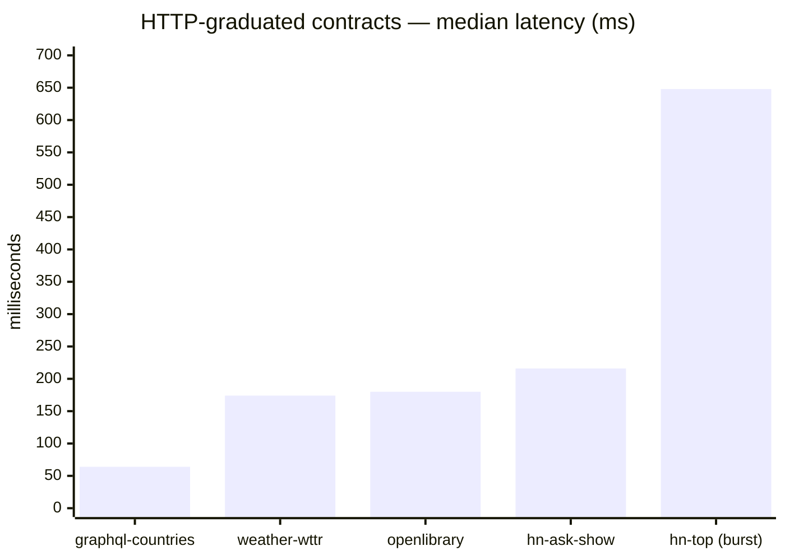
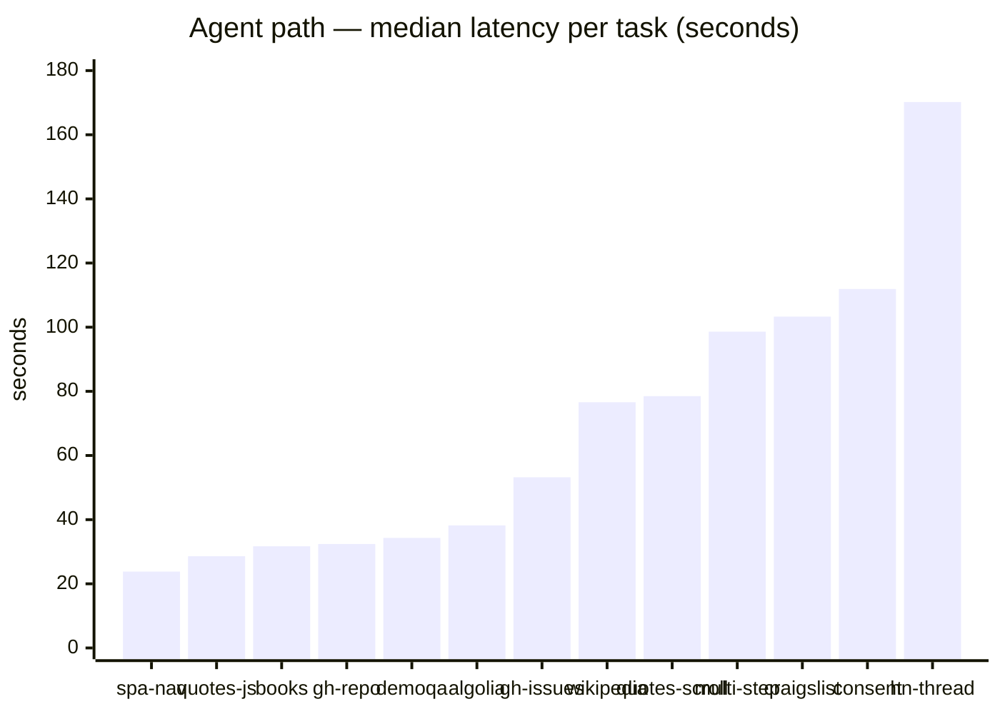
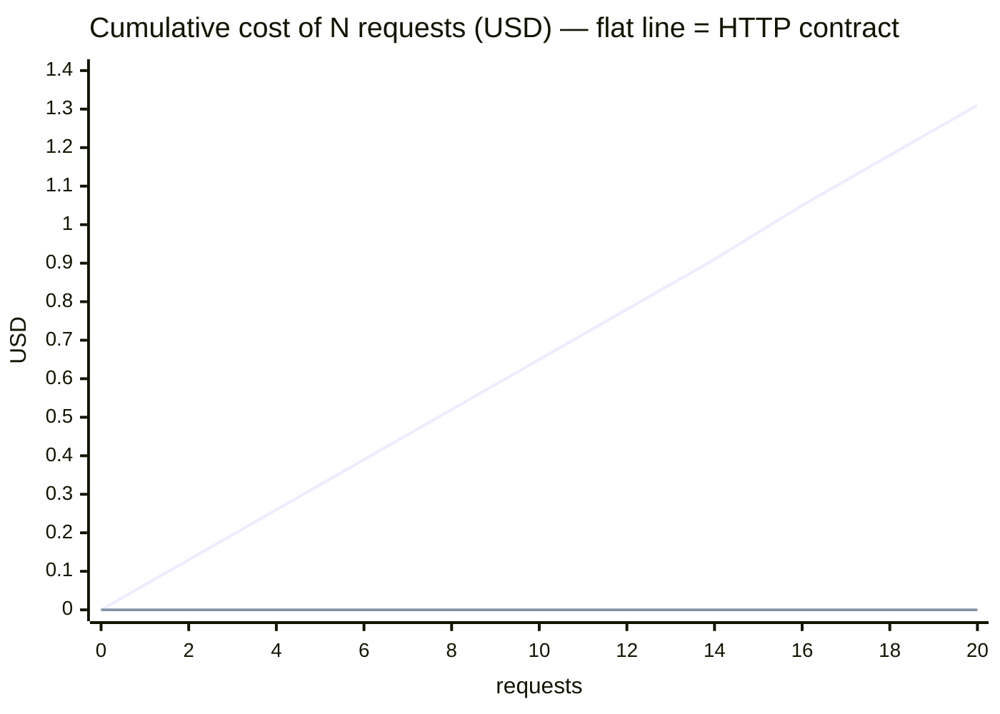
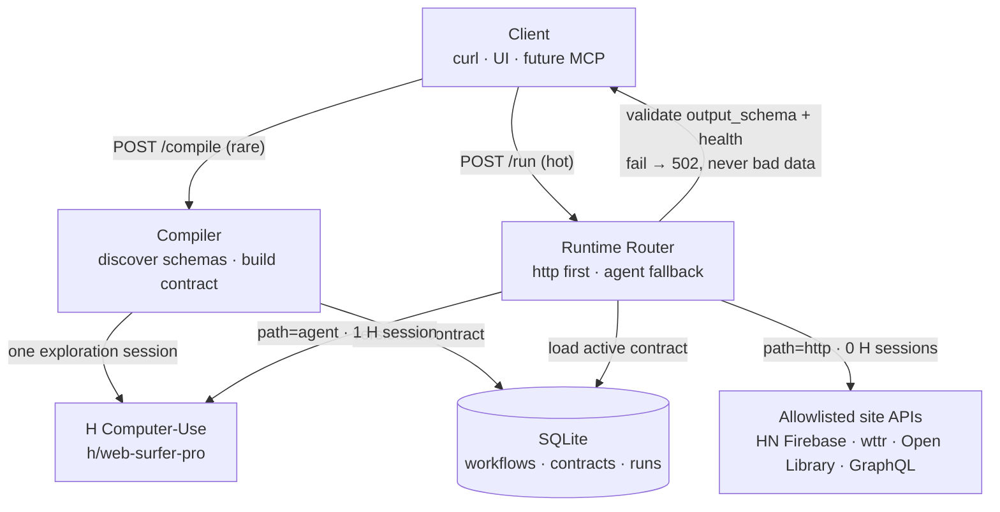
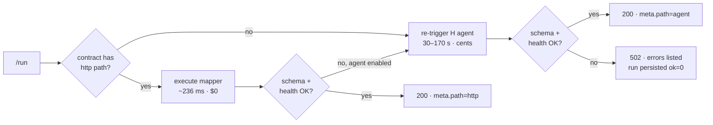

# API H

Compile a website workflow into a versioned **contract**, then serve it as a REST endpoint
that prefers cheap HTTP and falls back to an H Company Computer-Use agent only when it must.

## What is API H

H agents can operate any website, but every invocation costs a full browse: 30–120 seconds
of computer-use and task-level agent fees. Most repeat questions against the same site do
not need that. API H runs the agent (or a mock) **once at compile time** to figure out how
a workflow can be fulfilled, stores the result as an immutable, versioned contract in
SQLite, and serves `POST /run` behind a runtime router:

1. If the contract has an HTTP fulfillment path (a real API discovered or selected at
   compile time), call that. Milliseconds to seconds, roughly free.
2. If HTTP is not configured, fails, or the output fails schema/health validation, fall
   back to re-triggering the H agent.
3. Every response carries `meta.path` (`http` or `agent`) and `latency_ms` — the router
   never swaps paths silently.

The thesis: **H is the compiler and the fallback; the contract + router is the product;
the local database is the source of truth for versions and runs.**

Analogy: the H agent is a person walking through the building. The contract is the
receptionist window. The HTTP path is phoning the records room. The agent path is sending
the person to walk the building again.

## Measured results (live 19-site eval)

All numbers below are from a live battery against real sites with real H sessions —
100 recorded runs, $1.24 total spend, K=2 concurrent sessions. Raw data:
[`data/eval_results.jsonl`](data/eval_results.jsonl) · full report:
[`data/eval_report.md`](data/eval_report.md).

| Cohort | Runs | Success | p50 latency | Cost per run |
|---|---|---|---|---|
| **HTTP-graduated contracts** (HN, wttr, Open Library, GraphQL) | 85 | 100% | **236 ms** | **$0.00** |
| **Agent path, JS-heavy sites** (CSR, SPA, scroll, consent, bot walls) | 11 | 91% | 38.2 s | ~$0.04 |
| Agent path, other | 4 | 100% | 105 s | ~$0.09 |

The two paths live in different universes — that gap is the product:





Amortization — the same 20 requests, both ways. The agent line is measured means
(80 s, 6.5¢/run); the HTTP line is the measured concurrent burst (16.7 s total, $0):



The JS litmus tests both passed live via **discovered** (not hand-written) schemas:
`quotes.toscrape.com/js` (CSR-rendered, 28.6 s) and `/scroll` (infinite scroll, 78.5 s).
The one failure was the right kind: a bot wall reported as `blocked` in 24.6 s —
fail-closed, no hang, no fabricated data.

## Autobrowse vs API H

Same insight (agent runs are expensive; amortize them), different artifact.

|  | Autobrowse (Browserbase) | API H |
|---|---|---|
| First run | Agent browses the site | H Computer-Use agent browses the site (or a mock) |
| What gets saved | A reusable *skill* for future agent runs | A versioned *contract*: schemas + HTTP steps + agent prompt |
| Who consumes it | The next agent session | Any HTTP client — curl, a backend, a cron job |
| Repeat cost | A cheaper/faster agent run | A plain HTTP call when possible; agent only on fallback |
| Runtime dependency | Browser infrastructure every run | None on the happy path |
| Failure handling | Agent adapts in-session | Schema + health validation, explicit fallback, manual recompile |

Autobrowse graduates a skill for the next agent. API H graduates a contract for any HTTP
client.

## H products used

- **H Company Computer-Use Agents** (`hai-agents` Python SDK, agent `h/web-surfer-pro`) —
  used at compile time to verify a workflow goal, and at run time as the fallback path
  with a structured output schema.
- Not Browserbase, not Stagehand, no browser runtime of our own. The `hai-agents` package
  is optional: without `HAI_API_KEY` (or with `API_H_MOCK_H=true`) the app runs fully
  offline in mock mode and `/health` reports `"h_mode": "mock"`.

## Contract anatomy

The contract is a JSON document stored in `contracts.body_json` (and exported to
`contracts/<slug>-v<version>.json` on activation). Annotated:

```jsonc
{
  "id": "uuid",                       // contract id — immutable once written
  "workflow_id": "uuid",
  "version": 1,                       // bumps on every (re)compile; old versions kept
  "status": "active",                 // draft | active | deprecated
  "title": "Hacker News top stories",
  "site": "https://news.ycombinator.com",
  "goal": "Return top N front-page stories with rank, title, url, points",

  // What callers may send. Defaults are applied at run time.
  "input_schema": {
    "type": "object",
    "properties": {"limit": {"type": "integer", "default": 5, "minimum": 1, "maximum": 30}}
  },

  // What every path — HTTP or agent — must produce. Validated with jsonschema.
  "output_schema": {
    "type": "object",
    "required": ["stories"],
    "properties": {
      "stories": {
        "type": "array",
        "items": {
          "type": "object",
          "required": ["rank", "title", "url", "points"],
          "properties": {
            "rank": {"type": "integer"},
            "title": {"type": "string"},
            "url": {"type": "string"},
            "points": {"type": "integer"},
            "hn_url": {"type": "string"}
          }
        }
      }
    }
  },

  // Router strategy: http (http-first), agent (always agent), hybrid (http, then agent).
  "method": "hybrid",

  // The cheap path: concrete HTTP steps plus a named mapper that shapes the responses
  // into output_schema. This is fulfillment logic, not a cached answer.
  "http": {
    "enabled": true,
    "description": "HN Firebase API",
    "steps": [
      {"name": "topstories", "method": "GET",
       "url_template": "https://hacker-news.firebaseio.com/v0/topstories.json"},
      {"name": "item", "method": "GET",
       "url_template": "https://hacker-news.firebaseio.com/v0/item/{id}.json",
       "foreach": "top_ids"}
    ],
    "mapper": "hn_firebase_v0"
  },

  // The fallback path: how to re-trigger H for any valid input.
  "agent": {
    "enabled": true,
    "agent_id": "h/web-surfer-pro",
    "prompt_template": "Open {{site}}. Return the top {{limit}} stories as JSON matching the schema. Fields: rank, title, url, points, hn_url.",
    "answer_schema_ref": "output_schema"
  },

  // Cheap sanity checks applied to every successful path before returning.
  "health": {
    "min_array_length": {"path": "stories", "min": 1},
    "required_paths": ["stories.0.title", "stories.0.url"],
    "max_latency_ms": 15000
  },

  "compiled_at": "ISO-8601",
  "compile_meta": {"engine": "mock", "session_id": null,
                   "notes": "Discovered or selected Firebase path for HN"}
}
```

The critical rule: **caching answers is not a contract.** A contract stores *how to
fulfill any valid input* — new inputs get fresh data through the same plan.

### Schema discovery — you don't have to write the schemas

Create a workflow with only `slug`, `title`, `site`, and `goal`, and the first compile
**discovers** the schemas: one H exploration session achieves the goal, the JSON it
returns becomes the `output_schema` (inferred field by field — a field missing from some
items becomes optional), and any `{{var}}` placeholders in your goal become the
`input_schema` (`{{limit}}` gets integer semantics, everything else is a string).
The discovered schemas are persisted onto the workflow, the sample answer is stored in
the contract's `compile_meta.sample_answer` as a fixture, and every subsequent `/run`
reuses the stored contract — discovery happens once, not per request.

```bash
# 1. Create — no schemas, just intent. {{limit}} becomes a run input.
curl -s -X POST http://127.0.0.1:8000/v1/workflows \
  -H 'content-type: application/json' \
  -d '{
    "slug": "craigslist-apartments",
    "title": "Craigslist SF Bay apartments",
    "site": "https://sfbay.craigslist.org/search/apa",
    "goal": "Return the top {{limit}} apartment listings with title, price and url"
  }' | jq

# 2. Compile — the one H exploration run; discovers + stores schemas, contract v1.
curl -s -X POST http://127.0.0.1:8000/v1/workflows/craigslist-apartments/compile \
  -H 'content-type: application/json' \
  -d '{"engine": "auto", "activate": true}' | jq

# 3. Run — uses the stored contract from here on (agent path for Craigslist:
#    no known public API, so each run re-triggers H; see the wrapper-trap caveat).
curl -s -X POST http://127.0.0.1:8000/v1/workflows/craigslist-apartments/run \
  -H 'content-type: application/json' \
  -d '{"input": {"limit": 5}}' | jq
```

In mock mode the discovery answer is the deterministic placeholder, so the inferred
schema is a placeholder too — recompile with live H (`HAI_API_KEY` set,
`API_H_MOCK_H=false`) for real discovery. Explicit schemas at creation time are still
accepted and skip discovery entirely (that's how the HN demo pins its exact shape).

## When H is called vs not

| Situation | H agent called? |
|---|---|
| Compile in live mode (`HAI_API_KEY` set, mock off) | Yes — one Computer-Use session to verify the goal (and discover schemas when none were given) |
| Compile in mock mode | Probe skipped (discovery uses the deterministic mock), contract still built |
| Run, `method=http`/`hybrid`, HTTP path succeeds | No |
| Run, HTTP path fails or output fails validation/health, agent enabled | Yes (mock in mock mode) |
| Run with `force_path=agent` | Yes (mock in mock mode) |
| Run, `method=agent` (generic non-HN sites) | Yes (mock in mock mode) |
| `GET` endpoints (workflows, contracts, runs, openapi.json, health) | Never |

Mock executions still report `path="agent"` in `meta` — the mock stands in for the agent
path so the demo contrast stays honest.

## Quickstart

Requires Python 3.11+ and [uv](https://docs.astral.sh/uv/). No H API key needed — the
default is mock mode.

```bash
uv sync
uv run uvicorn app.main:app --port 8000     # terminal 1
uv run python scripts/seed.py               # terminal 2: workspace + HN workflow + contract
./scripts/demo_curl.sh                      # health → compile → run http → run force agent
```

Then open http://127.0.0.1:8000/ for the minimal UI, or:

```bash
curl -s -X POST http://127.0.0.1:8000/v1/workflows/hn-top-stories/run \
  -H 'content-type: application/json' \
  -d '{"input": {"limit": 5}}' | jq '.meta.path, .meta.latency_ms'
```

For live H mode: copy `.env.example` to `.env`, set `HAI_API_KEY`, set
`API_H_MOCK_H=false`, and install the optional `hai-agents` package (`uv add hai-agents`).
A full step-by-step live walkthrough — Craigslist via schema discovery, from clone to
run — is in [docs/LIVE-DEMO.md](docs/LIVE-DEMO.md).

Tests run fully offline (no network, no key):

```bash
uv run pytest
```

### Hard eval battery

Beyond the offline suite (mappers, router, SSRF allowlist, 20-way `/run` concurrency),
`scripts/hard_eval.py` drives a **running server** through a 19-task battery — HTTP-API
sites, GraphQL, and JS-heavy agent sites (CSR, SPA, infinite scroll, consent walls) —
recording per-run JSONL and a markdown report with cohort stats, failure taxonomy, and
gate results (see `docs/EVAL-SPEC.md`). Live agent tasks cost real H sessions, so cap
them:

```bash
uv run uvicorn app.main:app --port 8000     # terminal 1
uv run python scripts/hard_eval.py \
  --base-url http://127.0.0.1:8000 --tasks all \
  --h-concurrency 2 --max-agent-runs-total 40 --max-cost-usd 5.0 \
  --out data/eval_results.jsonl --report data/eval_report.md
```

Use `--tasks weather-wttr,graphql-countries` for a cheap HTTP-only smoke, and
`--skip-compile-if-active` to reuse already-compiled contracts.

## Architecture



Every run is one router pass:



<details>
<summary>ASCII version</summary>

```
┌──────────────────────────────────────────────┐
│  Client (curl / UI / future MCP)             │
└────────────────────┬─────────────────────────┘
                     │ POST /run  POST /compile
                     ▼
┌──────────────────────────────────────────────┐
│  API H (FastAPI)                             │
│  ┌─────────────┐  ┌────────────────────────┐ │
│  │ Compiler    │  │ Runtime Router         │ │
│  │ → contract  │  │ http → agent fallback  │ │
│  └──────┬──────┘  └───────────┬────────────┘ │
│         │                     │              │
│         ▼                     ▼              │
│  ┌────────────┐      ┌──────────────┐        │
│  │ SQLite     │      │ HN Firebase  │        │
│  │ contracts  │      │ (no H)       │        │
│  │ runs       │      └──────────────┘        │
│  └────────────┘      ┌──────────────┐        │
│                      │ H Computer-  │        │
│                      │ Use (compile │        │
│                      │  + agent run)│        │
│                      └──────────────┘        │
└──────────────────────────────────────────────┘
```

</details>

## Cost intuition

| Path | Measured latency (live eval) | Measured cost |
|---|---|---|
| `http` (graduated contracts) | 64 ms – 1.05 s (p50 236 ms) | $0.00 |
| `agent` (H Computer-Use) | 24 s – 170 s per run | ~$0.01 – $0.13 per run (from H's own metrics) |

The router exists to keep as many runs as possible in the first row. A visual version of
these results lives at [`site/index.html`](site/index.html).

## Caveats

- **Not every site has an insta-API.** Many workflows never graduate past `method=agent`.
  The HN demo works because HN publishes a real public API; that is the exception, not
  the rule.
- **ToS and robots.txt are your responsibility.** API H does not check them. The HN
  Firebase API is public and documented; other sites may forbid automation.
- **Agents are non-deterministic.** Agent output is validated against `output_schema` on
  every run, and runs that fail validation fail loudly. Validation is mandatory, not
  optional.
- **Auth walls and CAPTCHAs are out of scope** for this MVP. No credential handling, no
  session persistence, no solving.
- **Mock mode is a development stand-in, not H.** It returns deterministic fake stories
  after a simulated delay so the codebase runs and tests pass offline. It proves the
  plumbing, not the agent.
- **HTTP graduation is hand-registered.** The four specialized mappers (`hn_firebase_v0`,
  `wttr_v0`, `openlibrary_search_v0`, `graphql_countries_v0`) are hand-built. A generic
  HAR→OpenAPI discovery pipeline — automatic graduation — is future work, not present.
- **The wrapper trap.** If every request ends up on the agent path, you have built a
  proxy with extra steps, not a product. Watch the `path` distribution in `runs`.
- **SSRF allowlist.** The HTTP executor only calls four allowlisted hosts over https
  (`hacker-news.firebaseio.com`, `wttr.in`, `openlibrary.org`,
  `countries.trevorblades.com`). Any other host is rejected — for GET and POST alike.
  Widening the allowlist is a deliberate decision, not a config default.
- **`HAI_API_KEY` is never logged.** Keep it in `.env` (gitignored); see `.env.example`.
- **Self-healing is manual.** A failing contract is fixed with `POST /recompile`, which
  bumps the version. No automatic doctor yet.

## Future work

Deliberately out of scope for the MVP (see `docs/SPEC.md` §Non-goals):

- Browserbase/Autobrowse-style runtime and Stagehand integration
- Generic HAR→OpenAPI discovery pipeline (auto-derive HTTP steps for arbitrary sites)
- HoloTab import
- Skill/contract marketplace
- Automatic self-healing doctor (health-triggered recompile instead of manual `POST /recompile`)
- Billing and metering
- Desktop computer-use
- MCP server surface for the run endpoint

## Pitch snippets

**15 seconds:** "H agents can use any website but cost a full browse every time. API H
compiles one run into a versioned contract and serves REST — HTTP when we can, H only
when we must."

**vs Autobrowse:** "Autobrowse graduates a skill for the next agent. We graduate a
contract for any HTTP client."

**Judge trap ('isn't this caching?'):** "Cache stores answers. Contract stores how to
answer for new inputs."

## References

- H Computer-Use Agents: https://hub.hcompany.ai/computer-use-agents/introduction
- `hai-agents` SDK: https://github.com/hcompai/hai-agents-python
- H Company: https://hcompany.ai/
- Autobrowse (pattern reference only): https://browserbase.com/blog/autobrowse/
- Hacker News API: https://github.com/HackerNews/API
